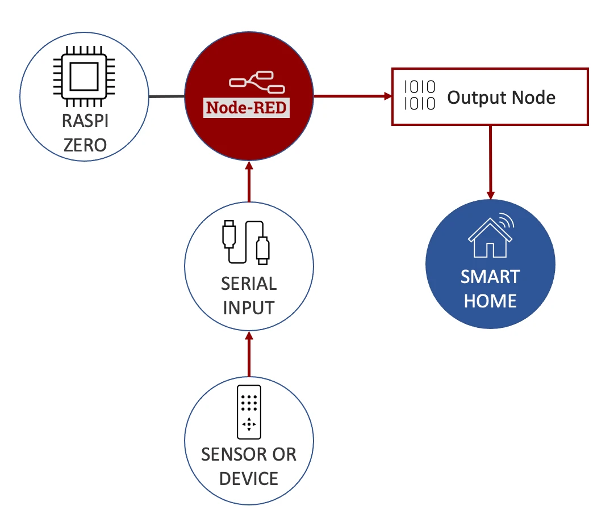
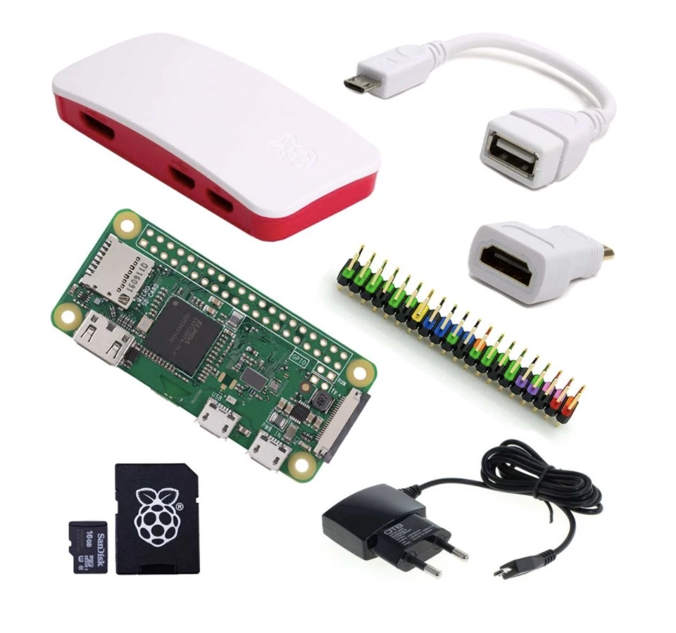
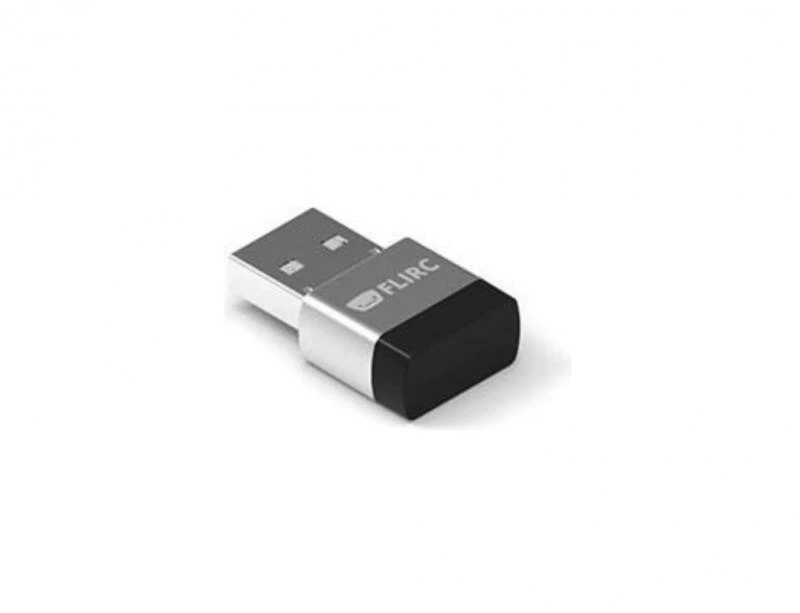

+++
title = 'IR-Remote Control 4.0 – Alles ins IoT!'
slug = 'ir-remote'
image = '01_ir_remote_teaser.webp'
date = 2022-12-03
lastmod = 2022-12-03
draft = false
tags = ['deutsch']
+++

Universalfernbedienung? Mehr 90er geht es ja nicht! Was aber wenn die alte Infrarot Fernbedienung 
alle Lichter im Raum ein- und ausschalten, die Heizung oder Rollos bedienen und das 
Heimkino gleichzeitig steuern kann? Dieser Beitrag hat es in sich, denn auf diese Art lässt sich 
jedes irgendwie auslesbare/anbindbare Gerät in euer Alexa, HomeKit oder nahezu jede andere Smart 
Home Lösung integrieren! Das alles ohne Abos, versteckte Kosten und auf Wunsch auch ganz ohne die 
Cloud irgendeines großen Konzerns.



## Zielsetzung

In dieser kleinen Aufbauanleitung beschreibe ich wie ich aus mehreren Komponenten ein IoT 
(Internet of Things) Szenario aufgebaut habe. Ein grundsätzliches technisches Verständnis hilft 
dabei die einzelnen Schritte nachzuvollziehen, 
ein IT-Studium oder eine ähnliche Ausbildung ist aber definitiv nicht erforderlich!

Das Ziel ist es mit einer handelsüblichen (gerne auch aus dem untersten Preissegment, 
oder noch besser: Elektroschrott) Infrarot Fernbedienung verschiedene Aktionen in einem Smart Home auszulösen. 
Ich will von einer einfachen Hardwareumgebung aus, beim Eintreffen eines Infrarotsignals, 
dessen Eingabewerte an meine Heimautomatisierung übergeben.

Als Hardware nutzen wir den kleinen Bruder des weltberühmten Raspberry Pi, 
den Zero W und wenig weiteres Zubehör. Alles davon kann auch ohne Mühen für andere Zwecke genutzt werden. 
Dank tausenden von verfügbaren “Bastelanleitungen” im Netz ist die eventuelle 
Neuanschaffung auf keinen Fall umsonst.

Bei der Software wähle ich wie immer möglichst ausschließlich Open Source Quellen, 
wie z.B. Linux und Node-RED. Die gigantische Community dahinter leistet uns eine 
24/7 Unterstützung bei jeglicher Art von Problemstellung.

## Hardware

Viel mehr als in der Zielsetzung beschrieben braucht es wirklich nicht. 
Falls du die Komponenten nicht herumliegen hast, hier zunächst ein paar Kaufempfehlungen.



Ab ca. 16 € gibt es den Kleinstcomputer Raspberry Pi Zero W mit passendem Gehäuse 
z.B. hier: https://www.berrybase.de/raspberry-pi/raspberry-pi-computer/kits/raspberry-pi-zero-w-zusammenstellung-zero-43-case. 
Der Zero ist für unseren Zweck besonders gut geeignet, 
weil wir zum einen keine besonders große Leistung benötigen, 
zum anderen aber Strom sparen wollen. Denn wir planen einen Dauerbetrieb. 
Mit einer Spannung von 2,3 bis 5,0 V und einer Stromstärke von 100 bis 140 mA, 
müsste der tatsächliche Stromverbrauch zwischen 0,23 Watt und 0,7 Watt liegen. 
Das ist weniger als so mancher Fernseher im Standby “frisst”. Das klingt vielleicht 
alles super “billig”, winzig und schwach, aber: Es ist 2021 und das bisschen Hardware 
hat die gleiche Rechenleistung wie ein Spitzen-Heimcomputer kurz nach der Jahrtausendwende. 
Und Windows XP wollen wir ja gar nicht installieren…

Damit der Raspberry funktioniert braucht es noch Strom, am besten aus einem alten Handynetzteil mit Micro-USB Anschluss. Falls gerade keines verfügbar ist, bekommt man so etwas Überall für wenige Euro, so z.B. auch im Supermarkt.
Hinzu kommt noch eine Micro-SD Karte, die vielleicht auch noch irgendwo zuhause herumliegt. 
Alles ab 8GB Größe ist OK, nur sollte sie über den Zusatz “XD” oder “HC” verfügen, 
damit man sicher ist nicht eine “lahme Ente” zu verwenden. Da geht es bei ca. 3 € los und auch 
hier wird man in den meisten Supermärkten fündig.

Ein kleines Adapterkabel hilft uns Geräte mit normalgroßem (Typ A) USB-Anschluss, wie den Infrarotempfänger, mit dem Raspberry Pi Zero zu verbinden. Das wiederum wird man eher selten im Supermarkt finden, aber z.B. hier: https://www.berrybase.de/raspberry-pi/raspberry-pi-computer/kabel-adapter/usb-kabel-adapter/usb-2.0-hi-speed-otg-adapterkabel-a-buchse-micro-b-stecker-0-15m-wei-223. Und damit ist man weitere 1,80 € ärmer.
Wer nun über gar keine dieser Komponenten verfügt, kann sich auch ein Komplettset besorgen, z.B. hier: https://www.berrybase.de/raspberry-pi/raspberry-pi-computer/kits/raspberry-pi-zero-w-zusammenstellung-full-starter-kit
Um die SD-Karte später mit dem Betriebssystem bespielen zu können, brauchen wir noch ein SD-Kartenleser. Die meisten Laptops haben einen solchen integriert. Aber falls nicht, gibt es die auch günstig ab 5€ fast überall und z.B. hier: https://www.heise.de/preisvergleich/sandisk-mobilemate-single-slot-cardreader-sddr-b531-gn6nn-a2356696.html



Bei der Fernbedienung hat man die Qual der Wahl. Wirklich jegliche Art von Gerät, das ein Infrarotsignal sendet, kommt hier in Frage. Es sollte natürlich keine genommen werden, die zu einem aktiv benutzten Gerät im gleichen Raum gehört, aber das versteht sich hoffentlich von selbst. Ich habe eine alte Universalfernbedienung benutzt, die ich noch übrighatte. Damit habe ich es mir selbst einen kleinen Tick schwieriger gemacht als nötig, da ich diese nun auf ein nicht vorhandenes Empfangsgerät voreinstellen musste. Einfacher wäre es gewesen, wirklich eine ganz “normale” zu verwenden.

Zum Schluss noch der Infrarotempfänger. Das ist tatsächlich fast die größte Investition hier im Projekt. Ich hatte noch den, qualitativ hochwertigen und mit cleverer Softwarelösung kommenden, FLIRC USB-Empfänger. Den bekommt man z.B. hier: https://www.heise.de/preisvergleich/flirc-usb-rev-2-flirc-v2-a1621664.html, ab ca. 24 €

Alles in allem also eine Investition zwischen 0€ und maximal 65€ Euro.

## Software

Nun zum zumindest für Anfänger komplizierten Teil, aber immerhin: viel Software braucht es nicht. Eigentlich nur ein Betriebssystem und zwei zusätzliche Programme/Tools. Da sich die Fernbedienung am einfachsten über eine Desktopumgebung konfigurieren lassen wird, installieren wir diese auf unsere SD-Karte. Das geht mittlerweile maximal einfach. Unter https://www.raspberrypi.org/software/ gibt es das Programm “Raspberry Pi Imager”, welches ihr dort für euer Betriebssystem herunterladen könnt. Vor dem Öffnen des heruntergeladenen und installiertem Programms steckt ihr noch die SD-Karte in euren SD-Karten-Lesegerät bzw. -slot. Im Programm wählt ihr dann das Betriebssystem “Raspberry PI OS (32-Bit)” aus, und als SD-Karte die eurige. Mit einem Klick auf “SCHREIBEN” wird das Betriebssystem auf eure Karte kopiert.

Sobald der Vorgang abgeschlossen ist, entfernt ihr die Karte bitte noch NICHT. Denn wir wollen zuvor noch zwei Dinge erledigen, die uns das Leben anschließend erleichtern. Falls schon, vor Ungeduld oder welchem Grund auch immer, herausgezogen ist das auch kein Problem, einfach wieder rein damit. Zunächst erstellen wir im Hauptverzeichnis der SD-Karte eine, gerne auch leere, Datei mit dem Namen “ssh”. Bitte achtet darauf, dass die Datei keine versteckte Endung wie z.B. “.txt” hat. Das passiert gerne unter den Standardeinstellungen von Windows. Mac und Linux Anwender haben dieses Problem in der Regel nicht. Wem das zu ungenau beschrieben ist, der guckt bitte hier: https://www.shellhacks.com/raspberry-pi-enable-ssh-headless-without-monitor/.

Jetzt möchten wir noch gleich die Verbindungsdaten zu unserem WLAN angeben, damit die Netzwerkverbindung von Anfang an sichergestellt ist. Dazu legen wir eine zweite Datei Namens “wpa_supplicant.conf” in das Gleiche Verzeichnis. Windows Benutzer passen wieder bei der Dateiendung auf. Dieses Mal kommt es aber auf den Inhalt der Datei an:

```bash
country=DE
ctrl_interface=DIR=/var/run/wpa_supplicant GROUP=netdev
update_config=1
network={
    ssid="DerNameDeinesWLANs"
    psk="DeinWLANPasswort"
    key_mgmt=WPA-PSK
}
```

Das ist nur ein Beispiel, und wir müssen die Werte in den Klammern bei den Zeilen “ssid” und “psk” auf die Werte unseres WLANs setzen.

Jetzt sind wir aber fertig und die Karte kann entfernt und in den Raspberry gesetzt werden. Nun steckt ihr alle Komponenten zusammen und bringt das Ganze an seinen Bestimmungsort. Sobald ihr das Gerät mit dem Netzteil verbunden habt, seht ihr:

### Erstmal nicht viel.

Kein Grund zur Panik, das ist normal und ihr habt vermutlich alles richtig gemacht. Wir machen einfach weiter.

Wir sind jetzt in der Lage uns per SSH auf dem kleinen Raspberry anzumelden, um dort ein paar Dinge einzustellen. Um sich kurz auf Kommandozeilenebene die Finger schmutzig zu machen, kommen wir leider nicht herum und leider lässt sich dafür im Falle des Raspberry Pi Zeros auch nicht Visual Studio Code verwenden. Ein Terminal muss her.

Unter MacOS und Linux ist eine Terminal Applikation für die Kommandozeile seit je her eingebaut und heißt dort auch so. Soweit ich weiß, steht das SSH Kommando auch in Windows 10 zur Verfügung, kann das aber leider gerade nicht testen. Allen die damit nicht vertraut sind, hilft Google gerne weiter. Die Verbindung zu unserem neuen Kleinstcomputer stellen wir dann wie folgt her:
```bash
ssh pi@192.168.178.22
```

Die IP-Adresse muss natürlich auf die eures Raspi angepasst werden. Die bekommt ihr am schnellsten über das Webinterface eures Routers heraus. Das Standardpasswort nachdem ihr nun gefragt werdet ist: raspberry . Wenn ihr das nach der Anmeldung gleich ändern möchtet, geht das mit dem Befehl “passwd”. Es empfiehlt sich Betriebssystem und Software regelmäßig auf den neuesten Stand zu bringen, das macht man mit den Befehlen:
```bash
sudo apt-get update
```

um aktuell verfügbare Pakete zu ermitteln, um diese dann wiederum mit:
```bash
sudo apt-get upgrade
```
zu installieren. Jetzt installieren wir Node-RED mit dem Befehl:
```bash
bash <(curl -sL https://raw.githubusercontent.com/node-red/linux-installers/master/deb/update-nodejs-and-nodered)
```
und wenn wir schon dabei sind, bestimmen wir noch, dass Node-RED bei jedem Systemstart automatisch gestartet wird:
```bash 
sudo systemctl enable nodered.service
```
Nun starten wir das System am besten einmal neu. Das geht mit:
```bash
sudo reboot
```

Nach spätestens 3-4 Minuten sollte alles wieder hochgefahren sein und wir müssten in der Lage sein auf Node-RED, über den Browser eines beliebigen Gerätes in eurem Netzwerk, zuzugreifen:
```
https://192.168.178.22:1880
```

Auch hier die IP-Adresse durch die eures Raspis ersetzen. Wenn sich nun die Weboberfläche von Node-RED öffnet, können wir unseren ersten Erfolg feiern. Wir haben aus unserem kleinen Raspi ein mächtiges IoT Werkzeug gemacht!

Jetzt wollen wir uns daran machen unsere Fernbedienung zu konfigurieren. Dafür müssen wir noch einmal die Kommandozeile bemühen und uns wie zuvor beschrieben auf den Raspi schalten. Als Erstes prüfen wir, ob uns der Desktop des Raspis später zur Verfügung stehen wird. Wie das geht, ist perfekt hier: https://www.raspberrypi.org/documentation/remote-access/vnc/ beschrieben. Dort auf den Abschnitt “Enabling VNC Server at the command line” fokussieren, den Rest können wir für den Moment ignorieren.

Auch auf Kommandozeilenebene installieren wir die grafische Oberfläche für unseren Flirc Infrarotempfänger. Das geht mit (copy & paste):
```bash
curl apt.flirc.tv/install.sh | sudo bash
```

Jetzt haben wir alles zusammen was wir brauchen und können endlich mit dem richtigen Spaß beginnen.

## Konfiguration

Verglichen mit der Softwareinstallation, ist die eigentliche Konfiguration nun ein “Klacks”.

Im ersten Schritt lernen wir unsere Fernbedienung an. Dazu schalten wir uns per VNC auf den Desktop des Raspberry PI Zero. Dort öffnen wir dann das Programm Flirc, welches wir im Startmenü finden. Bevor es losgeht, stellen wir die Ansicht noch auf “Keyboard” um. Dadurch stehen uns schon ohne Tastenkombinationen mehr als 127 Kommandos (Tasten) zur Verfügung, die wir auf unserer Fernbedienung belegen können. Da wir niemals eine echte Tastatur an den Raspi anschließen werden, ist das Einzige, worauf wir achten müssen, dass wir keine Sondertasten belegen. Die “Drucken” Taste zu belegen ist also keine gute Idee, alle Zahlen und Buchstaben: kein Problem. Um die Belegung zu starten, klicken wir im Programm auf eine der angezeigten Tasten, also z.B. “F”. Dadurch werden wir nun aufgefordert unsere Fernbedienung in Richtung des Infrarot Empfänger zu halten und darauf ebenfalls einen Knopf zu drücken. Dieses Prozedere spielen wir für alle Knöpfe auf unserer Fernbedienung durch, die wir später mit einer Aktion hinterlegen wollen. Jetzt ist unsere Fernbedienung “angelernt” und wir können die VNC Session wieder beenden. Das FLIRC Programm kann vorher auch beendet werden, es läuft im Hintergrund weiter und unsere Kommandos stehen auch nach einem Neustart weiterhin zur Verfügung.

Ab hier darf jetzt Node-RED zeigen was es kann. Und das Programm macht es uns maximal einfach! Wir öffnen wieder im Browser eines beliebigen Endgeräts unseres Netzwerks die Node-RED GUI:
```
https://192.168.178.22:1880
```

Unser Flow (Ablauf) benötigt nur zwei Knoten aus dem “Standardsortiment”. Als erstes ziehen wir aus der linken Leiste einen “rpi – keyboard” Knoten in den Flow. Der macht nichts anderes als, wie der Name es erahnen lässt, auf Tastatureingaben am Raspi zu lauschen. Durch unsere Konfiguration von FLIRC hört er so automatisch auch auf die Eingaben unserer Fernbedienung. Wer das Testen oder einfach sehen möchte, ob es funktioniert, fügt einen Debug nun in den Flow ein und verbindet diesen mit dem Ausgang unseres “rpi – keyboard” Nodes. Nach einem Klick auf Deploy oben rechts sollte nun nach jedem druck auf der Fernbedienung auf einen angelernten Knopf, eine Nachricht im Debug Fenster auftauchen. So weit so gut.

Nun wollen wir uns mit der Außenwelt verbinden. Dafür stehen uns unterschiedlichste Möglichkeiten zur Auswahl. So können wir die Ereignisse bereits mit Node-Red Bordmitteln in eine Datei schreiben, mit einem Webservice Aufruf koppeln oder auch eine Nachricht über einen Websocket übertragen. Auch stehen MQTT, TCP, UDP und sogar die serielle Ausgabe als Übertragungsmöglichkeit im Standard offen. Damit sollte eigentlich schon jeder Wunsch abgedeckt sein, aber noch mehr Komfort zur Integration in bestehende Smart Home Netze gibt es durch optionale installierbare Module. So machen wir unser Setup mit dem Modul “node-red-contrib-homekit-bridged” z.B. zu einem HomeKit Endgerät nach Apple Standard. Das gleiche funktioniert auch mit OpenHab https://flows.nodered.org/node/node-red-contrib-openhab3 oder sogar Alexa https://flows.nodered.org/node/node-red-contrib-virtual-smart-home und eigentlich allem was es so auf dem Markt gibt und über ein Netzwerk kommuniziert. Ich persönlich habe mich für die Übertragung via Websockets ohne zusätzliches Modul entschieden.

<hr>

### Halt, Stop! Warum auf einmal jetzt Websockets?

In meinem ersten Aufbau hatte ich die Kommandos der Fernbedienung über eine “normale” API zu übertragen versucht. Das funktioniert zwar ebenso prächtig ist aber zu langsam! Beim Drücken eines Knopfes auf einer Fernbedienung erwartet jeder eine sofortige Reaktion bzw. Aktion. 1 Sekunde Verzögerung fühlt sich unnatürlich an, 2 Sekunden sind bereits unerträglich. Man stelle sich vor man will z.B. die Lautstärke des Fernsehers stück für stück erhöhen. Ganz schnell habe ich 20-mal oder öfter gedrückt und die API-Kommandos werden langsam abgearbeitet. So arbeitet man erfolgreich an einem Hörsturz. Jeder der jetzt gerade Kopfkino spielt: Ja, genau so ist es mir ergangen…

Vor ähnlichen Erfahrungen möchte ich euch schützen und deswegen greifen wir gleich auf Websockets zurück. Ohne zu tief in die Grundlagen der Informatik eingehen zu wollen, handelt es sich bei Websockets um eine Interprozesskommunikation (IPC) über das HTTP (WEB) Protokoll. Anders formuliert: Mit Websockets bauen wir einen Tunnel zwischen zwei oder mehr Geräten zur Echtzeitkommunikation auf. Genau was wir hier brauchen!

<hr>

Der zweite Knoten, den wir in den Flow ziehen ist also ein “Websocket out” aus dem Netzwerkbereich. Auf diesen hört wiederum ein „Websocket in“ in meiner Heimautomatisierungslösung, die ebenfalls mit Node-Red realisiert ist. Wenn ihr ein anderes System zur Heimautomatisierung einsetzt, wäre die Eingabe des “rpi – keyboard” Nodes/Knotens an das entsprechende Modul weiterzuleiten. So lässt sich eben auch, wie in der Einleitung angekündigt, jedes andere Gerät in euer IoT einbinden.

## Fazit

In unserem kleinen Versuch haben wir spielerisch aus einer alten Infrarot Fernbedienung eine sinnvolle Erweiterung unserer Smart Homes geschaffen. Da unser Raspi Zero nur wenig Strom verbraucht, wäre theoretisch auch eine Energieversorgung über einen Akku oder eine Powerbank denkbar, womit das ganze Setup sogar mobil werden würde.

Der ein oder andere “Profi” wird darüber geschimpft haben, warum ich auf dem kleinen Raspberry Pi Zero eine Desktopumgebung installiert habe, anstelle darauf der geringen Ressourcen zuliebe zu verzichten. Das habe ich probiert und das Anlernen der Fernbedienung über FLIRC hat auf diese Art reichlich wenig Spaß gemacht. Außerdem sagt uns htop, dass auf dem Raspi auch bei laufendem Desktop nur ca. 100 von 512 MB Arbeitsspeicher belegt sind.

Ich hoffe der Artikel war interessant und hat zu der ein oder anderen neuen Idee für private oder auch berufliche Projekte geführt!
