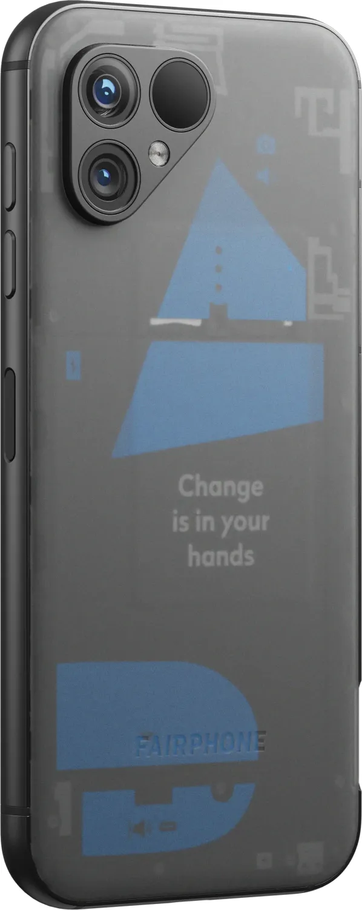
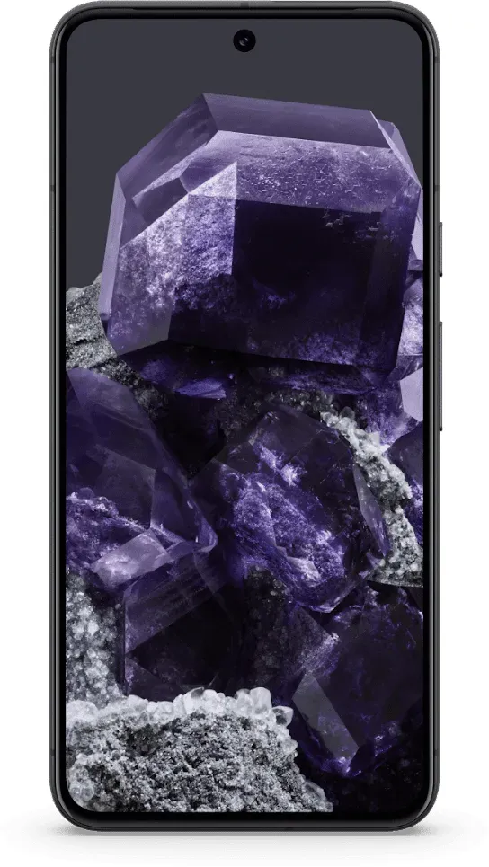
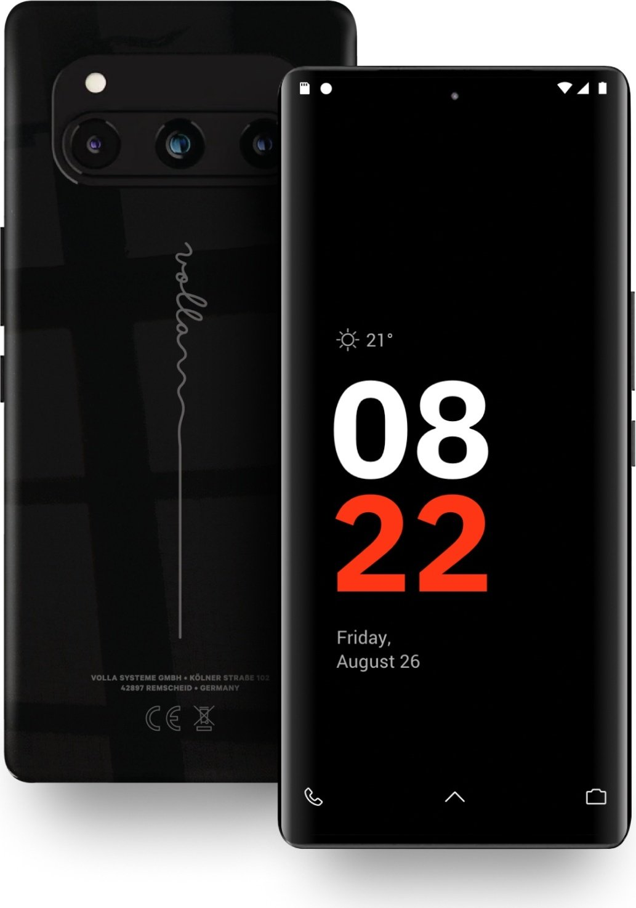
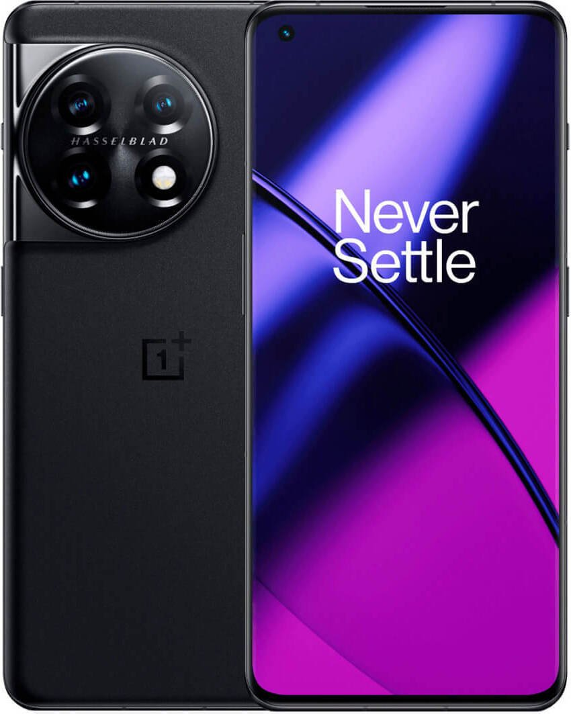
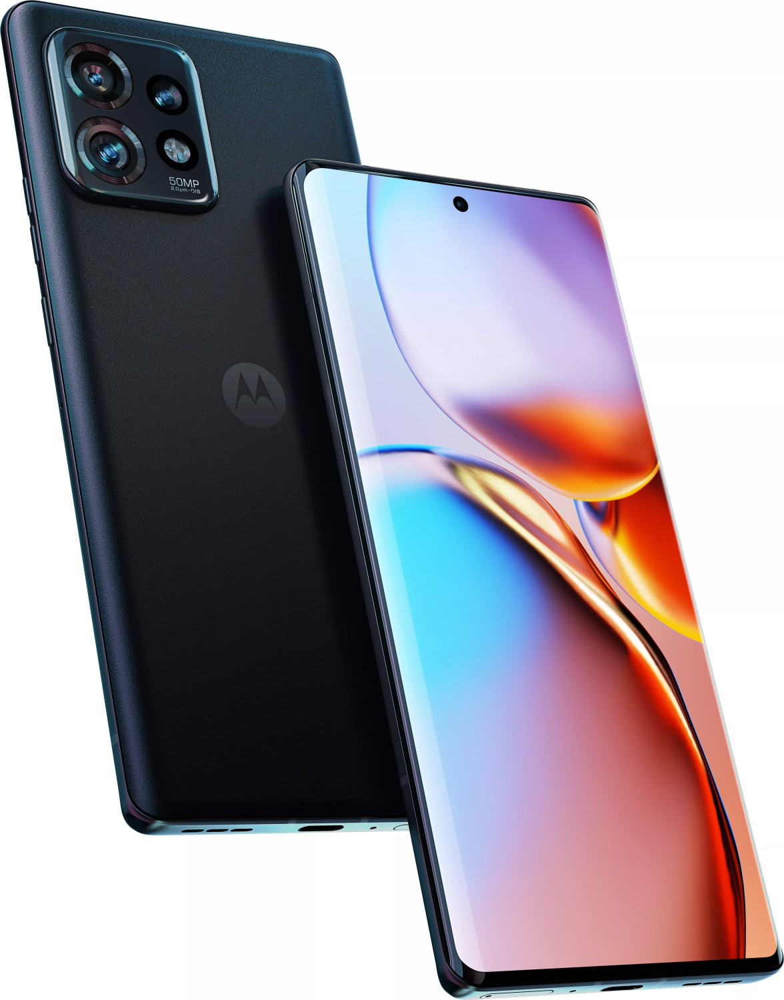
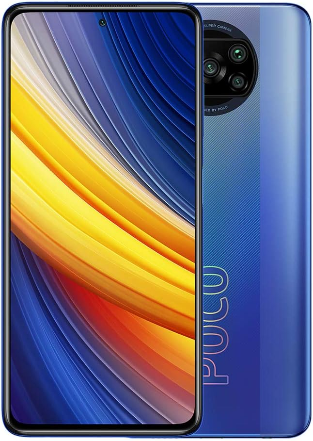
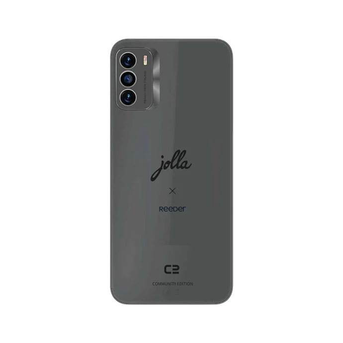

+++
title = 'Mobiltelefone 2025: Der King in Datenschutz und Nachhaltigkeit'
slug = 'oss-mobiles-2025'
image = 'mobile2025_web.webp'
date = 2025-05-01
lastmod = 2025-05-01
draft = false
tags = ['Open Source', 'Hardware']
summary = 'Ein Überblick über nachhaltige Mobiltelefone 2025, die die Daten des Benutzers schützen.'
+++

**Ein Überblick über nachhaltige Mobiltelefone 2025, die die Daten des Benutzers schützen.**

Ständig werden neue Handys auf den Markt geworfen und von unabhängigen Agenturen, Zeitschriften und Personen getestet. Der Fokus dieser Tests liegt jedoch meist auf der Hardwareleistung des Geräts. Beim Betriebssystem wird in 99 % der Fälle einfach hingenommen, dass auf dem Gerät sowohl von Google als auch vom Hardwarehersteller eventuell unerwünschte und vor allem datenhungrige Applikationen vorinstalliert werden. In vielen Fällen lassen sich diese dann nicht einmal deinstallieren.  
Deshalb konzentriert sich dieser unabhängige Test ganz auf den Aspekt des Datenschutzes und behandelt die anderen Kriterien nur beiläufig. Zuvor räumen wir aber noch mit falschen Vorstellungen über den Zusammenhang zwischen Open Source, Linux, Android und Google auf.

---

## Für ungeduldige Leser: Das Vergleichsergebnis

Hier die Ergebnisse des Vergleichs im Überblick. Die genaue Beschreibung der einzelnen Handys und die Vergleichstabelle findest du weiter unten.

**Gesamtsieger:**  
**Fairphone 5** (30 Punkte) – Beste Kombination aus Datenschutz, Nachhaltigkeit und Alltagstauglichkeit.

**Technischer Sieger:**  
**Google Pixel 8 Pro** (27 Punkte) – Überragende Kamera, Top-Hardware, lange Updates.

**Preis-Leistungs-Sieger:**  
**Xiaomi Poco X3 NFC** (24 Punkte) – Sehr gutes Gesamtpaket zum günstigen Preis, mit LineageOS-Unterstützung.

**Ranking (Punkte):**  
1. Fairphone 5 (30)  
2. Volla Phone X23 (28)  
3. Google Pixel 8 Pro (27)  
4. Volla Quintus (26)  
5. Google Pixel 9 (26)  
6. OnePlus 11 (25)  
7. Motorola Edge 40 Pro (25)  
8. Xiaomi Poco X3 NFC (24)  
9. Motorola Moto G32 (23)  
10. Jolla C2 Community Phone (19)

---

## Open Source, Linux, Android und Google

Open Source bedeutet nicht automatisch Datenschutz oder Sicherheit. Viele Menschen setzen Open-Source-Software mit sicherer und datenschutzfreundlicher Software gleich, was jedoch nicht immer der Realität entspricht. Es ist wichtig, die Unterschiede und Zusammenhänge zwischen Open Source, Linux, Android und den Diensten von Google zu verstehen.

Open Source bedeutet zunächst einmal, dass der Quellcode einer Software öffentlich einsehbar ist. Dadurch können Entwickler und Experten den Code überprüfen, Schwachstellen identifizieren und zur Verbesserung beitragen.

Linux ist ein Open-Source-Betriebssystem, das als Grundlage für viele andere Systeme dient, einschließlich Android. Es bietet eine hohe Flexibilität und Anpassungsfähigkeit, jedoch hängen Datenschutz und Sicherheit stark von der jeweiligen Implementierung und den darauf aufbauenden Diensten ab. Da auch Android auf Linux basiert, erbt es zwar einige der Vorteile von Open Source, ist jedoch stark von den Entscheidungen und Diensten von Google geprägt, was den Datenschutz beeinflussen kann.

Das heißt: Ein Mobiltelefon, auf dem Android ohne Google-Dienste betrieben wird, kann als deutlich datenschutzfreundlicher betrachtet werden.

---

## Alternativen zu Android

Es gibt natürlich auch noch andere Optionen als Android, wie beispielsweise Apples iOS oder andere Linux-basierte Betriebssysteme.  
iOS ist jedoch proprietär (nicht Open Source) und stark in das Apple-Ökosystem eingebunden. Auf Apple-Mobiltelefonen ist es außerdem nicht möglich, alternative Betriebssysteme zu installieren.  
Deshalb stellen in diesem Test Apples Telefone keine Option dar.

Eine weitere Möglichkeit sind Linux-basierte Betriebssysteme wie /e/OS, LineageOS oder Ubuntu Touch, die ohne Google-Dienste auskommen und den Fokus auf Datenschutz legen.  
Hier muss man auch wieder unterscheiden, ob es sich beim Betriebssystem um ein von den Google-Diensten befreites Android handelt, wie das z. B. bei LineageOS der Fall ist, oder um eine eigenständige Distribution wie z. B. Sailfish OS.

Während sich auf den Android-Systemen grundsätzlich alle dafür entwickelten Anwendungen ausführen lassen und man ggf. nur auf einen nicht von Google betriebenen App-Store ausweichen muss, sieht die Sache bei einer eigenständigen Distribution anders aus.

Da sich aktuell kaum Entwickler an den Entwicklungen zu eigenständigen Distributionen beteiligen und diese auch nur ein winziges Zielpublikum bedienen, herrscht bei der Auswahl von Anwendungen größtenteils gähnende Leere. An dieser Situation wird sich auch mittelfristig nichts ändern, weshalb wir diese in unserem Test ebenfalls ignorieren werden.

---

## Testkriterien

Die Bewertung basiert auf folgenden Kriterien (jeweils 0–5 Punkte):

1. Google-freies Android ab Werk oder ohne Funktionsverlust installierbar
2. Zeitgemäße Hardware (CPU, RAM, Speicher)
3. Nachhaltigkeit (Austauschbarkeit von Komponenten)
4. Kameraqualität
5. Akkukapazität

Maximal sind 30 Punkte erreichbar.

---

## Die Testkandidaten im Überblick

### Fairphone 5

Das Fairphone 5 ist das nachhaltigste Gerät im Test. Es überzeugt mit modularer Bauweise, langer Ersatzteilverfügbarkeit und einem wechselbaren Akku. Die Hardware ist solide, die Kamera gut, und es gibt offiziellen Support für alternative Android-Versionen wie /e/OS und LineageOS. Wer Wert auf Datenschutz und Reparierbarkeit legt, findet hier die beste Option – auch wenn der Preis im oberen Bereich liegt.

**Technische Daten:**  
Betriebssystem: Android (LineageOS-Support)  
Display: 6,46", 2770x1224 Pixel  
Kamera hinten: 50 MP  
Kamera vorne: 50 MP  
SoC: Qualcomm QCM6490, 8 Kerne  
RAM: 8 GB  
Speicher: 256 GB, microSD-Slot  
Akku: 4200 mAh, wechselbar  
Besonderheiten: IP55, MIL-STD-810H, Stereo-Lautsprecher  
Preis: 578 €

---

### Volla Phone X23

Das Volla Phone X23 kommt ab Werk mit einem Google-freien Android (Volla OS) und bietet einen wechselbaren Akku sowie robuste Bauweise (IP68, MIL-STD-810H). Die Hardware ist solide, die Kamera gut, und der Preis ist fair. Für Datenschutz-Fans, die ein robustes und alltagstaugliches Gerät suchen, eine sehr gute Wahl.

**Technische Daten:**  
Betriebssystem: Volla OS  
Display: 6,1", 1560x720 Pixel  
Kamera hinten: 48 MP + 8 MP  
Kamera vorne: 16 MP  
SoC: MediaTek Helio G99, 8 Kerne  
RAM: 6 GB  
Speicher: 128 GB, microSD-Slot  
Akku: 5000 mAh, wechselbar  
Besonderheiten: IP68, MIL-STD-810H  
Preis: 564 €

---

### Google Pixel 8 Pro

Das Pixel 8 Pro bietet Top-Hardware, exzellente Kamera und lange Update-Garantie. Dank LineageOS-Support lässt sich ein Google-freies Android installieren, allerdings ist der Weg dahin nicht ganz trivial und der Akku ist nicht wechselbar. Wer Wert auf Kamera und Performance legt und bereit ist, das System umzubauen, bekommt hier ein sehr gutes Gesamtpaket.

**Technische Daten:**  
Betriebssystem: Android 15 (Update), LineageOS-Support  
Display: 6,7", 2992x1344 Pixel  
Kamera hinten: 50 MP + 48 MP + 48 MP  
Kamera vorne: 10,5 MP  
SoC: Google Tensor G3, 9 Kerne  
RAM: 12 GB  
Speicher: 128 GB  
Akku: 5050 mAh, fest verbaut  
Besonderheiten: IP68, 7 Jahre Updates  
Preis: 545 €

---

### Volla Quintus

Das Volla Quintus ist das Flaggschiff von Volla, kommt ebenfalls mit Google-freiem Android und sehr guter Hardware. Der Akku ist wechselbar, das Display groß und hell. Der Preis ist allerdings recht hoch, was das Preis-Leistungs-Verhältnis etwas schmälert.

**Technische Daten:**  
Betriebssystem: Volla OS (Android)  
Display: 6,78", 2400x1080 Pixel, AMOLED, 120 Hz  
Kamera hinten: 50 MP + 8 MP + 2 MP  
Kamera vorne: 15,9 MP  
SoC: MediaTek Dimensity 7050, 8 Kerne  
RAM: 8 GB  
Speicher: 256 GB  
Akku: 4600 mAh, wechselbar  
Besonderheiten: 5G, AMOLED, kabelloses Laden  
Preis: 719 €

---

### Google Pixel 9

Das Pixel 9 ist ähnlich stark wie das 8 Pro, etwas kompakter und günstiger. Auch hier gibt es lange Updates und LineageOS-Support. Die Kamera ist hervorragend, der Akku fest verbaut. Für alle, die ein aktuelles, leistungsstarkes Gerät mit Custom-ROM-Option suchen, eine sehr gute Wahl.

**Technische Daten:**  
Betriebssystem: Android 15 (Update), LineageOS-Support  
Display: 6,3", 2424x1080 Pixel, AMOLED  
Kamera hinten: 50 MP + 48 MP  
Kamera vorne: 10,5 MP  
SoC: Google Tensor G4, 8 Kerne  
RAM: 12 GB  
Speicher: 128 GB  
Akku: 4700 mAh, fest verbaut  
Besonderheiten: IP68, 7 Jahre Updates  
Preis: 569 €

---

### OnePlus 11

Das OnePlus 11 bietet Top-Hardware und ist für Custom-ROMs wie LineageOS geeignet. Der Akku ist allerdings nicht wechselbar und die Nachhaltigkeit ist nur durchschnittlich. Wer Wert auf Performance und ein gutes Preis-Leistungs-Verhältnis legt, findet hier ein starkes Gerät.

**Technische Daten:**  
Betriebssystem: Android (LineageOS-Support)  
Display: 6,7", 3216x1440 Pixel  
Kamera hinten: 50 MP  
Kamera vorne: 16 MP  
SoC: Snapdragon 8 Gen 2, 8 Kerne  
RAM: 8 GB  
Speicher: 128 GB  
Akku: 5000 mAh, fest verbaut  
Besonderheiten: IP64, Stereo-Lautsprecher  
Preis: 538 €

---

### Motorola Edge 40 Pro

Das Edge 40 Pro ist ein leistungsstarkes Gerät mit sehr guter Kamera und LineageOS-Support. Der Akku ist fest verbaut, die Reparierbarkeit eingeschränkt. Für Power-User, die ein Custom-ROM nutzen wollen, eine interessante Option.

**Technische Daten:**  
Betriebssystem: Android (LineageOS-Support)  
Display: 6,67", 2400x1080 Pixel  
Kamera hinten: 50 MP  
Kamera vorne: 60 MP  
SoC: Snapdragon 8 Gen 2, 8 Kerne  
RAM: 12 GB  
Speicher: 256 GB  
Akku: 4600 mAh, fest verbaut  
Besonderheiten: IP68, kabelloses Laden  
Preis: 499 €

---

### Xiaomi Poco X3 NFC

Das Poco X3 NFC ist ein günstiges, aber leistungsfähiges Gerät mit LineageOS-Support. Die Installation eines Google-freien Systems ist möglich, aber etwas umständlich. Die Hardware ist solide, die Kamera gut, der Akku groß. Für Sparfüchse mit Datenschutz-Anspruch eine sehr gute Wahl.

**Technische Daten:**  
Betriebssystem: Android 11 (Update), LineageOS-Support  
Display: 6,67", 2400x1080 Pixel, 120 Hz  
Kamera hinten: 64 MP + 13 MP + 2 MP + 2 MP  
Kamera vorne: 20 MP  
SoC: Snapdragon 732G, 8 Kerne  
RAM: 6 GB  
Speicher: 128 GB, microSD-Slot  
Akku: 5160 mAh, fest verbaut  
Besonderheiten: IP53, Stereo-Lautsprecher  
Preis: ca. 250 €

---

### Motorola Moto G32

Das Moto G32 ist das günstigste Gerät im Test und bietet solide Hardware für den Alltag. Es gibt LineageOS-Support, aber die Kamera und Performance sind nur durchschnittlich, und der Akku ist nicht wechselbar. Für Sparfüchse, die Wert auf Datenschutz legen, dennoch eine brauchbare Wahl.

**Technische Daten:**  
Betriebssystem: Android 12 (ab Werk), LineageOS-Support  
Display: 6,5", 2400x1080 Pixel  
Kamera hinten: 50 MP + 8 MP + 2 MP  
Kamera vorne: 16 MP  
SoC: Snapdragon 680, 8 Kerne  
RAM: 6 GB  
Speicher: 128 GB, microSD-Slot  
Akku: 5000 mAh, fest verbaut  
Besonderheiten: UKW-Radio, IP52  
Preis: 421 €

---

### Jolla C2 Community Phone

Das Jolla C2 Community Phone setzt auf Sailfish OS, ein Linux-basiertes System. Die Hardware ist solide, aber die Akkulaufzeit schwach, kein 5G, und die App-Auswahl ist sehr eingeschränkt. Für experimentierfreudige Nutzer mit Fokus auf Open Source, aber im Alltag nur bedingt empfehlenswert.

**Technische Daten:**  
Betriebssystem: Sailfish OS  
Display: 6,52", 1600x720 Pixel  
Kamera hinten: 64 MP  
Kamera vorne: 16 MP  
SoC: ARM Cortex, 8 Kerne  
RAM: 8 GB  
Speicher: 128 GB, microSD-Slot  
Akku: 4000 mAh, fest verbaut  
Besonderheiten: Kein GPS, kein 5G  
Preis: 284 € + 60 €/Jahr ab dem 2. Jahr

---

## Die Bewertungstabelle im Detail

| Kriterium                                      | Fairphone 5 | Volla X23 | Pixel 8 Pro | Volla Quintus | Pixel 9 | OnePlus 11 | Edge 40 Pro | Poco X3 NFC | Moto G32 | Jolla C2 |
|------------------------------------------------|-------------|-----------|-------------|---------------|---------|------------|-------------|-------------|----------|----------|
| Google-freies Android (ab Werk/Installierbar)  | 5           | 5         | 3           | 5             | 3       | 3          | 3           | 3           | 3        | 5        |
| Hardware (CPU, RAM, Speicher)                  | 4           | 4         | 5           | 5             | 5       | 5          | 5           | 4           | 3        | 3        |
| Nachhaltigkeit (Austauschbarkeit)              | 5           | 4         | 2           | 3             | 2       | 2          | 2           | 2           | 2        | 2        |
| Kameraqualität                                | 4           | 4         | 5           | 4             | 5       | 5          | 5           | 4           | 3        | 2        |
| Akkukapazität                                 | 4           | 5         | 5           | 4             | 4       | 5          | 4           | 5           | 5        | 2        |
| **Gesamtpunkte**                               | **30**      | **28**    | **27**      | **26**        | **26**  | **25**     | **25**      | **24**      | **23**   | **19**   |

**Legende:**  
5 = erfüllt das Kriterium voll und ganz  
4 = sehr gut, kleine Einschränkungen  
3 = durchschnittlich / akzeptabel  
2 = unterdurchschnittlich / größere Einschränkungen  
1 = ungenügend

---

## Fazit

Das Fairphone 5 ist die beste Wahl für alle, die Datenschutz, Nachhaltigkeit und Alltagstauglichkeit kombinieren wollen. Die Volla Phones sind für Puristen und Datenschutz-Fans sehr attraktiv. Die Pixel-Geräte bieten die beste Kamera und lange Updates, erfordern aber Eigeninitiative für ein Google-freies System. OnePlus und Motorola sind gute Allrounder, wenn Custom-ROMs und Preis-Leistung im Vordergrund stehen. Das Xiaomi Poco X3 NFC ist der Preis-Leistungs-Tipp für alle, die mit kleinen Abstrichen leben können. Das Jolla C2 ist ein spannendes Experiment, aber für den Alltag nur eingeschränkt geeignet.

---

**Links:**  
[Ubuntu Touch Geräteübersicht](https://devices.ubuntu-touch.io)  
[LineageOS](https://lineageos.org/)

